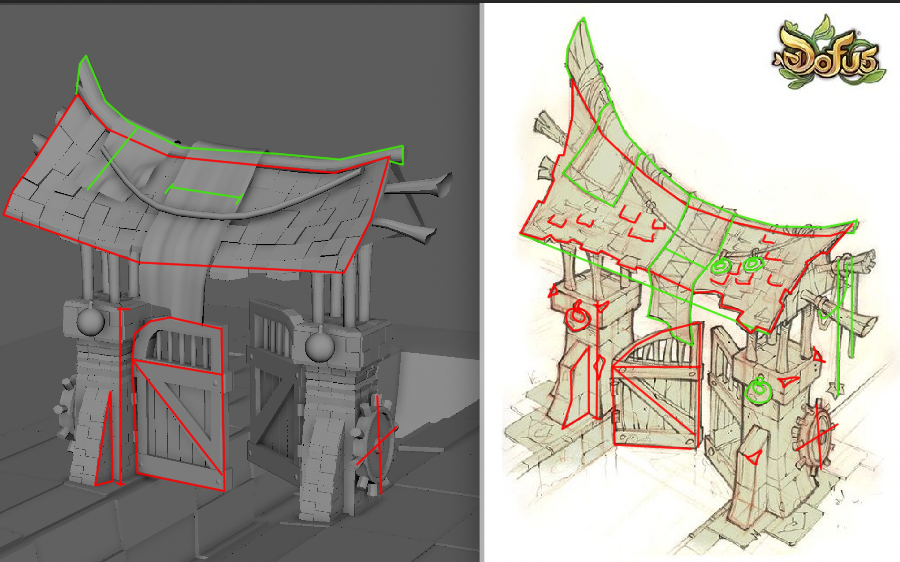

# 🧱 Mauricio Ventura – 3D Art Showcase

This repo highlights selected 3D modeling and environment design work from my time at Full Sail University and personal projects. My background in 3D pipelines now informs the GenAI systems I build, giving me a deep understanding of how assets are made, optimized, and deployed in real-world scenarios.

---

## 📬 Let’s Connect
[LinkedIn](https://www.linkedin.com/in/mauricio-ventura-52a14425a) • [Portfolio Google Drive](https://drive.google.com/drive/folders/1dkPJfTs0yhIqHl96e7kushHLTKjZIwOc)

---

## 🎨 Tools Used
`Maya`, `Blender`, `Substance Painter`, `Unreal Engine`, `Unity`, `ZBrush`, `Photoshop`

---

## 🧩 Featured Pieces

### 1. Stylized Gate Rebuild (Dofus Concept)
Recreated from a 2D concept (right) using clean low-poly modeling, stylized beveling, and detailed shape blocking. Modeled for game-engine compatibility.
- **Software**: Maya
- **Type**: Hand-modeled stylized asset
- **Focus**: Form language, translation from 2D to 3D, clean topology

---

### 2. Prop Still Life (Shader Study)
Scene combining multiple props, custom shaders, and lighting. Studied brass, rubber, wood, plastic, and soft reflection tuning.
- **Software**: Maya (original), Blender (conversion in progress)
- **Props Included**: GameBoy, trumpet, shoes, filing cabinet, toolbox
- **Focus**: Texturing consistency + material storytelling

---

## 🔄 Coming Soon
- **Turntable GIFs** of select props
- **Marmoset Viewer upload**
- **Downloadable `.blend` files for props**

---

## 🧠 Why It Matters
I’m now developing AI pipelines that will interface with 3D data — from prompts to assets to real-time memory. This work grounds me in how 3D is built and optimized, which helps me imagine more effective GenAI tooling for artists.

---

